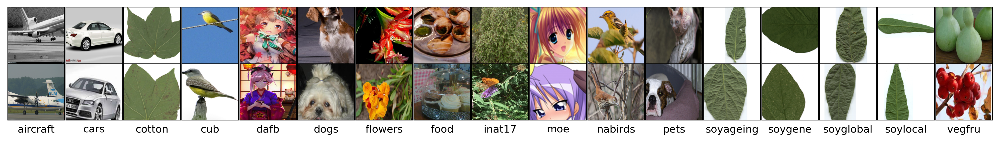
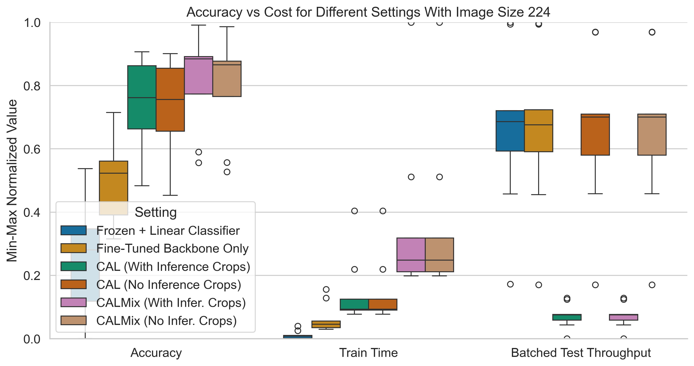
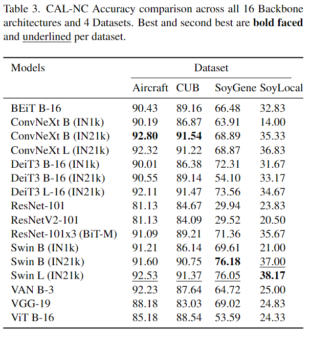

# Backbone Evaluation for Fine-Grained Image Recognition

Official PyTorch code for the paper: [A Large-Scale Study on the Accuracy vs Cost Trade-offs of Training and Evaluation Settings in Fine-Grained Image Recognition](http://arxiv.org/abs/2605.18700), published at the Fine-Grained Visual Categorization (FGVC13) Workshop @ CVPR 2026.

This project provides a comprehensive analysis and benchmarking framework for evaluating different backbone architectures on fine-grained image recognition (FGIR) tasks. The repository focuses on comparing various training strategies (Frozen, Fine-tuned, CAL, CALMix) across multiple neural network architectures and datasets, with detailed metrics on both accuracy and computational costs.

The primary experiments evaluate **9 original backbones** across **17 datasets**:
**Models:**
- `vit_b16` - ViT B-16
- `vgg19_bn` - VGG-19
- `van_b3` - VAN B-3
- `swin_base_patch4_window7_224_in22k` - Swin B (IN21k)
- `resnetv2_101x3_bitm_in21k` - ResNet-101x3 (BiT-M)
- `resnetv2_101` - ResNetV2-101
- `resnet101` - ResNet-101
- `convnext_base_in22k` - ConvNeXt B (IN21k)
- `beitv2_base_patch16_224_in22k` - BEiT B-16

**Datasets:** Aircraft, Cars, Cotton, CUB, DAFB, Dogs, Flowers, Food, iNat17, Moe, NABirds, Pets, SoyAgeing, SoyGene, SoyGlobal, SoyLocal, VegFru

### Phase 2: Extended Evaluation (20 models × 4 datasets)
Additional experiments expand the model coverage to **20 backbones** on only **4 datasets**:

**Models:**
- `convnext_large_in22k` - ConvNeXt L (IN21k)
- `convnext_base` - ConvNeXt B (IN1k)
- `deit3_large_patch16_224_in21ft1k` - DeiT3 L-16 (IN21k)
- `deit3_base_patch16_224_in21ft1k` - DeiT3 B-16 (IN21k)
- `deit3_base_patch16_224` - DeiT3 B-16 (IN1k)
- `swin_large_patch4_window7_224_in22k` - Swin L (IN21k)
- `swin_base_patch4_window7_224` - Swin B (IN1k)
- `resnet18` - ResNet-18
- `tv_resnet101` - ResNet-101
- `tv_resnet34` - ResNet-34
- `tv_resnet50` - ResNet-50

**Datasets:** Aircraft, CUB, SoyGene, SoyLocal

Samples of Dataset used:



Our CALMix variant improves accuracy further from CAL, but with more train time and the same problem of reduced inference throughput.

Our CAL-NC and CALMix-NC removes cropping during inference, restoring inference throughput comparable to Frozen or Fine-Tuned settings.



Extensive benchmark across models and datasets. Swin B (IN21k) and ConvNeXt B (IN21k) achieve best results

## Setup

```
pip install -e . 
```

## Preparation

All of these require to first `chmod +x script_name` the corresponding scripts.

To download pretrained checkpoints for CUB, DAFB, iNat17, NABirds (and vanilla In-21k ckpts):
```
./scripts/download_ckpts.sh
python tools/preprocess/download_convert_vit_models.py
```

To download datasets:
```
./scripts/download.sh
```

To prepare the train and validation splits from the train_val set for each dataset (otherwise can skip this step and just copy the ones we included in the `data` directory to each respective dataset directory in order to ensure the splits are the same as ours):
```
./prepare_datasets.sh
```

To download and prepare NCFM dataset (requires Kaggle API token):
```
./ncfm_prepare_dataset.sh
```

Dataset stats:
```
./scripts/calc_hw.sh
```

## Train

To train a `ViT B-16` with CALMix on CUB using image size 448:

```
python -u tools/train.py --serial 11 --cfg configs/cub_ft_weakaugs.yaml --seed 100 --lr 0.01 --model_name vit_b16 --selector cal --batch_size 4 --image_size 448 --cal_cm
```

To train a `ResNet-101` with traditional fine-tuning on Aircraft:
```
python -u tools/train.py --serial 1 --cfg configs/aircraft_ft_is224_weakaugs.yaml --seed 1 --lr 0.03 --model_name resnet101 --project_name Backbones
```

## Evaluation

To evaluate a particular checkpoint on the test set (logs results to W&B):

```
python -u tools/train.py --ckpt_path ckpts/aircraft_vit_b16_cal.pth --cfg configs/datasets/aircraft.yaml --test_only --test_multiple 0
```

Note: the `test_multiple 0` makes it so that the test script runs only once, by default it runs 5 times to allow more precise estimation of latency and throughput.

# Citation
If you find our work helpful in your research, please cite it as:

```
@misc{rios_large-scale_2026,
	title = {A {Large}-{Scale} {Study} on the {Accuracy} vs {Cost} {Trade}-offs of {Training} and {Evaluation} {Settings} in {Fine}-{Grained} {Image} {Recognition}},
	url = {http://arxiv.org/abs/2605.18700},
	doi = {10.48550/arXiv.2605.18700},
	abstract = {Prior work on fine-grained image recognition (FGIR) has established the importance of the backbone selection, but has neglected the accuracy-vs-cost trade-offs under different training and evaluation settings. In this work we conduct a large-scale study with over 2000 experiments across 6 training and evaluation settings, 9 pretrained backbones, and 17 datasets. Preliminary observations on the effectiveness of data augmentation for fine-grained training motivate us to extend Counterfactual Attention Learning (CAL), a state-of-the-art method based on data-aware cropping and masking augmentations, with cross-image discriminative region mixing augmentation. We also propose an efficient evaluation-only variant that maintains competitive accuracy while reducing inference costs by forfeiting the forward pass on discriminative crops that is normally used by CAL and similar FGIR methods. Our results show that data-aware augmentations during training only can enable a model to achieve excellent accuracy even without crops, significantly reducing inference costs. To support future research we share our code and checkpoints at: {\textbackslash}url\{https://github.com/arkel23/FGIR-Backbones\}},
	urldate = {2026-05-19},
	publisher = {arXiv},
	author = {Rios, Edwin Arkel and Surya, Augusto Christian and Gosal, Oswin and Mikael, Fernando and Nicole, Mary Madeline and Jang, Kisoon and Lai, Bo-Cheng and Hu, Min-Chun},
	month = may,
	year = {2026},
	note = {arXiv:2605.18700 [cs.CV]},
	keywords = {Computer Science - Computer Vision and Pattern Recognition},
}

```

# Acknowledgements
We thank NYCU's HPC Center and National Center for High-performance Computing (NCHC) for providing computational and storage resources. 

We thank the authors of [CAL](https://github.com/raoyongming/CAL), and [timm](https://github.com/huggingface/pytorch-image-models/) for their code we used as foundation.

Also, [Weight and Biases](https://wandb.ai/) for their platform for experiment management.
 